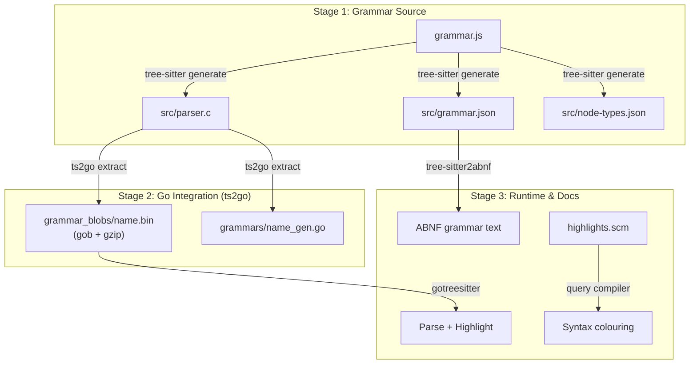

# Plain Text Accounting Formats — Documentation

<div class="columns">
<div class="column is-3">

<!-- auto:pages -->
<!-- /auto:pages -->

</div>
<div class="column is-9">

Comparison of plain text accounting (PTA) formats, each with a
[tree-sitter](https://tree-sitter.github.io/) grammar for parsing and syntax highlighting.

## The Formats

| Format | Style | Details |
|--------|-------|---------|
| [Beancount](beancount.html) | Transaction with postings (debit/credit implicit) | [overview](internal/beancount.html), [beancount.github.io](https://beancount.github.io/) |
| [Goluca](goluca.html) | Directed movements with `->` arrows | [overview](internal/goluca.html), [accounts](goluca-accounts.html), [datetime](goluca-datetime.html), [parameters](goluca-parameters.html), [tree-sitter-goluca](https://github.com/drummonds/tree-sitter-goluca) |
| [PTA](pta.html) | Directed movements (goluca-compatible, simplified) | [overview](internal/pta.html), [tree-sitter-pta](https://github.com/drummonds/tree-sitter-pta) |
| [Coin](internal/coin.html) | Ledger-cli model in Go | [mkobetic/coin](https://github.com/mkobetic/coin) |

The first three formats have tree-sitter grammars with ABNF, grammar.js, and
parser demos on their detail pages.
Coin is included as a comparison — a Go PTA tool with a different take on the ledger format.

## Key Differences

**Beancount** uses the traditional ledger model: a transaction header followed by
two or more posting lines, each naming an account and optionally an amount.
Amounts balance implicitly across postings.

**Goluca** (go-luca) replaces implicit balancing with explicit directional movements.
Each line names a `from-account -> to-account` pair with an amount, making the
flow of money visible. Inspired by Pacioli's double-entry notation.

**PTA** shares goluca's directional style but with a simplified grammar.
Both use the same arrow operators (`->`, `//`, `>`) and linked-movement syntax.

### Same Transaction in Three Formats

**Beancount:**
```beancount
2024-01-15 * "Tesco" "Weekly groceries"
  Expenses:Groceries   45.50 GBP
  Assets:Bank:Current
```

**Goluca:**
```goluca
2024-01-15 * Tesco
  Assets:Bank:Current -> Expenses:Groceries "Weekly groceries" 45.50 GBP
```

**PTA:**
```pta
2024-01-15 * Tesco
  Assets:Bank:Current -> Expenses:Groceries Weekly groceries 45.50 GBP
```

## Research

| Topic | Summary |
|-------|---------|
| [Repeating Transactions](research/repeating-transactions.html) | How PTA formats handle recurring transactions; readability vs information density trade-offs |

## Grammar Build Pipeline

Each format is defined by a `grammar.js` file in its own tree-sitter
repository. The pipeline from grammar source to usable Go parser runs
through three stages:



**Key files in each grammar repo** (e.g.
[tree-sitter-goluca](https://github.com/drummonds/tree-sitter-goluca)):

| File | Role |
|------|------|
| `grammar.js` | Source of truth — the grammar definition |
| `queries/highlights.scm` | Syntax highlighting capture rules |
| `test/corpus/*.txt` | Parser validation test cases |
| `tree-sitter.json` | Metadata (name, file extensions, bindings) |
| `src/parser.c` | Generated — LR parse tables (committed for downstream) |
| `src/grammar.json` | Generated — grammar metadata export |

All `src/` files are regenerated by `tree-sitter generate` but committed
so that downstream tools (ts2go, CI) can consume them without running
the generator.

## ABNF Grammar Summaries

Each format has a formal grammar defined in ABNF, generated from the
tree-sitter `grammar.json` by
[tree-sitter2abnf](https://github.com/drummonds/tree-sitter2abnf).
See the individual format pages for full definitions.

See [ABNF Standards and Extensions](abnf-variants.html) for details on the
ABNF variants and tree-sitter extensions used in these grammars.

ABNF highlighting in the docs uses a tree-sitter grammar from
[gotreesitter](https://github.com/drummonds/gotreesitter).

For background on ABNF in accounting contexts, see
[ABNF and Plain Text Accounting](https://www.bytestone.uk/posts/abnf-and-plain-text-accounting/)
on bytestone.uk.

## Related

- [Conversion: Beancount to Goluca](internal/beancount-to-goluca.html) — mapping rules and examples
- [mkobetic/coin](internal/coin.html) — a Go PTA tool with a different take on the ledger format
- [plaintextaccounting.org](https://plaintextaccounting.org/) — community resource covering all PTA tools

## Repositories

| Repo | Purpose |
|------|---------|
| [plain-text-accounting-formats](https://github.com/drummonds/plain-text-accounting-formats) | Go library and CLI for parsing/highlighting/converting PTA formats |
| [gotreesitter](https://github.com/drummonds/gotreesitter) | Pure-Go tree-sitter runtime (206 embedded grammars) |
| [tree-sitter-goluca](https://github.com/drummonds/tree-sitter-goluca) | Tree-sitter grammar for the Goluca format |
| [tree-sitter-pta](https://github.com/drummonds/tree-sitter-pta) | Tree-sitter grammar for the PTA format |
| [tree-sitter-beancount](https://github.com/polarmutex/tree-sitter-beancount) | Tree-sitter grammar for Beancount (upstream: polarmutex) |
| [tree-sitter2abnf](https://github.com/drummonds/tree-sitter2abnf) | Converts grammar.json to ABNF and back |
| [pta2svg](https://github.com/drummonds/pta2svg) | Renders Goluca/PTA movements as SVG flow diagrams |

## Links

<!-- auto:links -->
<!-- /auto:links -->

</div>
</div>
